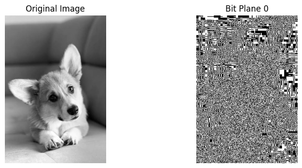
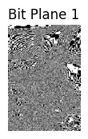
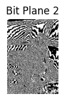
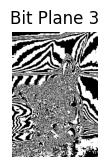
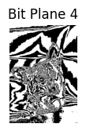

# Bit plane slicing







# AIM

To demonstrate **bit plane slicing** of a grayscale image by extracting and visualizing its individual **8-bit planes**.

# SOFTWARE USED

* **Google Colab**
* **Python**
* **OpenCV (`cv2`)**
* **NumPy**
* **Matplotlib**

# THEORY

## BIT PLANE SLICING

Bit plane slicing is an image processing technique used to analyze the individual **binary bits** that make up the pixel values of a grayscale image.

A grayscale image normally contains pixel values ranging from **0 to 255**, which can be represented using **8 bits**.

For example:

**255 = 11111111**

Each pixel can therefore be divided into **8 individual bit planes**, from **Bit Plane 0 to Bit Plane 7**.

## WORKING OF BIT PLANE SLICING

* The grayscale image is represented using **8-bit pixel values**.
* Each pixel contains 8 binary bits.
* The individual bits are extracted using **bitwise operations**.
* The operation `(img >> i) & 1` extracts the **i-th bit plane**.
* The extracted bit plane contains values of either **0 or 1**.
* These values are multiplied by **255** to make the bit plane visible as a grayscale image.
* All 8 bit planes are displayed separately for analysis.

## EFFECT OF DIFFERENT BIT PLANES

The 8 bit planes are divided into **lower-order bits** and **higher-order bits**.

* **Bit Plane 0** → Least Significant Bit (LSB), contains very fine image information.
* **Bit Plane 1–3** → Lower-order bits, generally contain finer details and noise.
* **Bit Plane 4–6** → Contain more significant image information.
* **Bit Plane 7** → Most Significant Bit (MSB), usually contains major structural information of the image.

Higher-order bit planes generally contribute more to the overall visual appearance of the image, while lower-order bit planes contain finer details.

## BITWISE OPERATION

The expression:

```python
bit_plane = (img >> i) & 1
```

is used to extract the **i-th bit** from every pixel.

* `img >> i` shifts the required bit to the rightmost position.
* `& 1` extracts only that bit.
* The result contains either **0 or 1**.
* Multiplying by `255` converts the values into **0 or 255** for visualization.

## APPLICATIONS

Bit plane slicing is useful in:

* Image analysis
* Image compression
* Image enhancement
* Image segmentation
* Feature extraction
* Image reconstruction
* Digital image processing

# CONCLUSION

The experiment demonstrates **bit plane slicing** by extracting and visualizing all **8 bit planes** of a grayscale image. The lower-order bit planes contain finer details, while the higher-order bit planes generally contain more significant structural information. This technique helps in understanding how different binary bits contribute to the overall information and appearance of a digital image.
